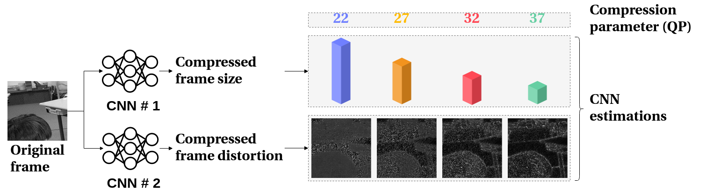

# Estimation of Rate Control Parameters for Video Coding Using CNN
Rate-control is essential to ensure efficient video delivery. 
Typical rate-control algorithms rely on bit allocation strategies, 
to appropriately distribute bits among frames. As reference frames 
are essential for exploiting temporal redundancies, intra frames 
are usually assigned a larger portion of the available bits. 
We proposed an accurate method to estimate number of bits and 
quality of intra frames, which can be used for bit 
allocation in a rate-control scheme. The algorithm is based on 
deep learning, where networks are trained using the original 
frames as inputs, while distortions and sizes of compressed frames 
after encoding are used as ground truths.



## Check our blog post
[Machine learning for video coding optimisation](https://www.bbc.co.uk/rd/blog/2020-04-machine-learning-video-coding-optimisation)

## Publication
2018 IEEE Visual Communications and Image Processing (VCIP).
The paper is available at 
[IEEE Xplore](https://dx.doi.org/10.1109/VCIP.2018.8698721) 
and [arXiv](https://arxiv.org/abs/2003.06315).

Please cite this work as:

```
@inproceedings{Santamaria2018,
  author = {M. Santamaria and E. Izquierdo and S. Blasi and M. Mrak},
  booktitle = {2018 IEEE Visual Communications and Image Processing (VCIP)},
  title = {Estimation of Rate Control Parameters for Video Coding Using CNN},
  year = {2018},
  doi = {10.1109/VCIP.2018.8698721},
  ISSN = {1018-8770},
  month = dec,
}
```

## How to use

### Dependencies
The code is compatible with Python 3.5.2 and TensorFlow 1.14.0. 

Install all dependencies with:

```bash
pip install -r requirements.txt
```

YUV files are accessed with [VMAF reader](https://github.com/Netflix/vmaf/blob/7c00e97088deab0f2de4c05a2c3fd85f6ed9c205/python/src/vmaf/tools/reader.py).


### Data preparation
Training data is generated from [MSCOCO dataset](http://cocodataset.org). 

#### Encoding data
1. Convert the images to YUV 420p 8bit and make sure the dimensions width x height are in the file name, i.e.
  `ffmpeg -i Lenna.png -pix_fmt yuv420p Lenna_512x512.yuv`
1. Encode the images with a video codec, such as HEVC, using different QPs and:
  1. Collect the bits per CTU, i.e. `x y bits` (`x` and `y` indicate the starting position of the CTU). 
  1. Keep the reconstructed YUV files. Add both the dimension width x height and QP to the file name, i.e `Lenna_512x512_QP_22.yuv`.
1. For each image, reformat the bits in a single text file like:
  `x y bits_qp_1 bits_qp_2 ... bits_qp_n`
1. Make sure you re-organise the data as follows

```bash
data
├── original
│   └── img1_512x512.yuv
├── reconstruction
│   └── img1
│       ├── img1_512x512_QP_22.yuv
│       ├── img1_512x512_QP_27.yuv
│       ├── img1_512x512_QP_32.yuv
│       └── img1_512x512_QP_37.yuv
└── bits
    └── img1.txt
```

Check the example in [resources](./resources).

#### Creating datasets
You need two create two different datasets, one for each model.

For the distortion model dataset, complete and run the following command:

```bash
python3 cnn-rate-distortion --task prepare_data --data_name [dataset name] --model_name distortion --input_dir [dir original yuv] --label_dir [dir reconstructed yuv] --width [CTU width] --height [CTU height] --levels [num QPs] --h5_dir [output dir]
```

Example:
```bash
python3 cnn-rate-distortion --task prepare_data --data_name Lenna --model_name distortion --input_dir ./resources/data/original --label_dir ./resources/data/reconstruction --width 128 --height 128 --levels 4 --h5_dir ./resources
```

For the rate model dataset, complete and run the following command:

```bash
python3 cnn-rate-distortion --task prepare_data --data_name [dataset name] --model_name rate --input_dir [dir original yuv] --label_dir [dir bits] --width [CTU width] --height [CTU height] --levels [num QPs] --h5_dir [output dir]
```

Example:
```bash
python3 cnn-rate-distortion --task prepare_data --data_name Lenna --model_name rate --input_dir ./resources/data/original --label_dir ./resources/data/bits --width 128 --height 128 --levels 4 --h5_dir ./resources
```

### Training
Once the datasets are created, train the models by completing and running the following command:

```bash
python3 cnn-rate-distortion --task train --model_name [model name] --data_name [dataset name] --epochs [max epochs] --batch_size [imgs per batch] --loss_type [function] --width [CTU width] --height [CTU height] --levels [num QPs] --archive_dir [output dir] --h5_dir [dir to dataset]
```

### Testing
Complete and run the following command to test the trained models:

```bash
python3 cnn-rate-distortion --task test --model_name [model name] --data_name [dataset name] --batch_size [imgs per batch] --loss_type [function] --width [CTU width] --height [CTU height] --levels [num QPs] --archive_dir [output dir] --test_data [path to test dataset]
```

## Acknowledgements
The work leading to this paper was co-supported by the [Engineering and 
Physical Sciences Research Council](https://epsrc.ukri.org/) of the UK 
through an [iCASE](https://epsrc.ukri.org/skills/students/industrial-case/intro/) 
grant in cooperation with the [British Broadcasting Corporation](https://www.bbc.co.uk/rd).


## Contact
If you have any general doubt about our work or code which may be of 
interest for other researchers, please use the [issues section](https://github.com/bbc/cnn-rate-distortion/issues).
Alternatively, drop us an e-mail at [maria.santamaria@bbc.co.uk](mailto:maria.santamaria@bbc.co.uk).
